# Лабораторная работа: Meowle Network Lab

**Выполнил:** Желанов Даниил  
**Группа:** Р4150  

## 1. Общая информация

**Дисциплина:** Сети и протоколы
**Тема:** Анализ сетевого взаимодействия мобильного приложения с backend API
**Приложение:** Meowle-lab.apk
**Среда выполнения:** Windows 11 + Android Emulator
**Прокси:** Fiddler Classic

Цель лабораторной работы — исследовать сетевое взаимодействие мобильного приложения Meowle с учебным сервером, перехватить HTTP-запросы, составить карту API, выполнить эксперименты с изменением запросов и ответов, а также описать найденные баги и security-проблемы.

---

## 2. Адреса стенда

| Компонент     | URL                                     |
| ------------- | --------------------------------------- |
| Frontend      | `http://144.31.255.0:8080`              |
| Backend API   | `http://144.31.255.0:3001`              |
| Swagger UI    | `http://144.31.255.0:3001/api-docs-ui/` |
| Version check | `http://144.31.255.0:3001/version`      |

---

## 3. Используемые инструменты

| Инструмент                | Назначение                          |
| ------------------------- | ----------------------------------- |
| Android Studio Emulator   | Запуск APK без физического телефона |
| Fiddler Classic           | Перехват HTTP-запросов и ответов    |
| Chrome в Android Emulator | Проверка доступности API            |
| Swagger UI                | Просмотр доступных API-методов      |
| Fiddler Composer / Replay | Повтор и изменение HTTP-запросов    |


---

## 4. Проверка настройки прокси

Для проверки доступности backend API был открыт адрес:

```text
http://144.31.255.0:3001/version
```

В Fiddler появился HTTP-запрос к серверу `144.31.255.0:3001`, что подтверждает корректную настройку прокси.

**Доказательство:**

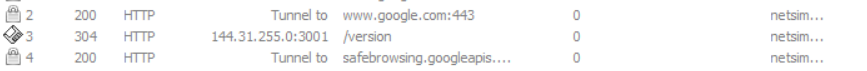

---

## 5. Авторизация в приложении

Для входа в приложение использовались тестовые данные:

```text
Имя: Алексей
Телефон: +79990000000
```

После входа была открыта вкладка рейтинга. В рейтинге отображались котики, значит приложение успешно подключилось к backend API.

**Доказательства:**

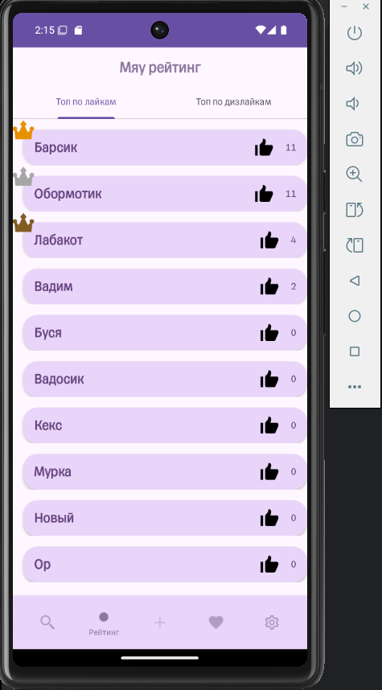

---

## 6. Разведка API через Swagger

Swagger UI был открыт по адресу:

```text
http://144.31.255.0:3001/api-docs-ui/
```

**Доказательство:**

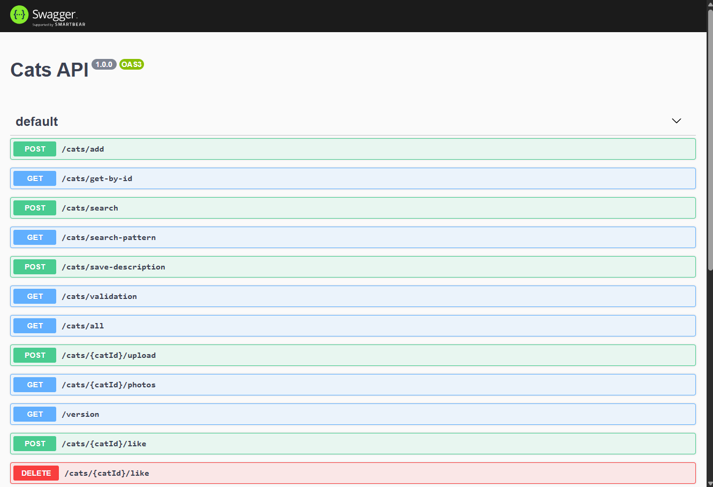

### 6.1. Таблица API-методов


| Method | Path                               | Назначение                      | Параметры                 | Пример запроса                         | Пример ответа                                          |
| ------ | ---------------------------------- | ------------------------------- | ------------------------- | -------------------------------------- | ------------------------------------------------------ |
| GET    | `/api/likes/cats/rating`           | Получение рейтинга котиков      | Нет                       | `GET /api/likes/cats/rating`           | JSON со списком котиков и количеством лайков/дизлайков |
| POST   | `/api/core/cats/search`            | Поиск котиков                   | `gender`, `name`, `order` | `POST /api/core/cats/search`           | JSON со списком найденных котиков                      |
| GET    | `/api/core/cats/get-by-id?id={id}` | Получение карточки котика по ID | `id`                      | `GET /api/core/cats/get-by-id?id=1`    | JSON с объектом `cat`                                  |
| POST   | `/api/likes/cats/{id}/likes`       | Лайк или дизлайк котика         | `id`, `like`, `dislike`   | `POST /api/likes/cats/1/likes`         | JSON с обновлёнными лайками/дизлайками                 |
| POST   | `/api/core/cats/add`               | Добавление нового котика        | `cats[]`                  | `POST /api/core/cats/add`              | JSON с созданным котиком                               |
| POST   | `/api/core/cats/save-description`  | Изменение описания котика       | `catId`, `catDescription` | `POST /api/core/cats/save-description` | JSON с обновлённым описанием                           |
| GET    | `/api/photos/cats/{id}/photos`     | Получение списка фото котика    | `id`                      | `GET /api/photos/cats/27/photos`       | JSON со списком URL изображений                        |
| POST   | `/api/photos/cats/{id}/upload`     | Загрузка фото котика            | `id`, multipart file      | `POST /api/photos/cats/27/upload`      | JSON с `fileUrl`                                       |
| GET    | `/photos/{filename}`               | Получение файла изображения     | `filename`                | `GET /photos/image-1780074640467.jpg`  | JPEG-файл                                              |

---

## 7. Карта действий приложения и HTTP-запросов

### 7.1. Открытие рейтинга

При открытии вкладки рейтинга приложение отправляет запрос на получение списка котиков с количеством лайков и дизлайков.

| Поле          | Значение                                         |
| ------------- | ------------------------------------------------ |
| Действие      | Открытие рейтинга                                |
| HTTP method   | GET                                              |
| URL           | `http://144.31.255.0:3001/api/likes/cats/rating` |
| Request body  | Отсутствует                                      |
| Response code | 200                                              |
| Response body | JSON со списком котиков                          |
| Комментарий   | Приложение получает рейтинг котиков              |

Фрагмент ответа:

```json
{
  "dislikes": [
    {
      "description": "Размохмаченный животик, мокрые лапки.",
      "dislikes": 9,
      "gender": "unisex",
      "id": 18,
      "likes": 11,
      "name": "Обормотик",
      "tags": ""
    },
    {
      "description": "Я это создавал",
      "dislikes": 5,
      "gender": "male",
      "id": 1,
      "likes": 39,
      "name": "Барсик",
      "tags": ""
    }
  ]
}
```

**Доказательство:**

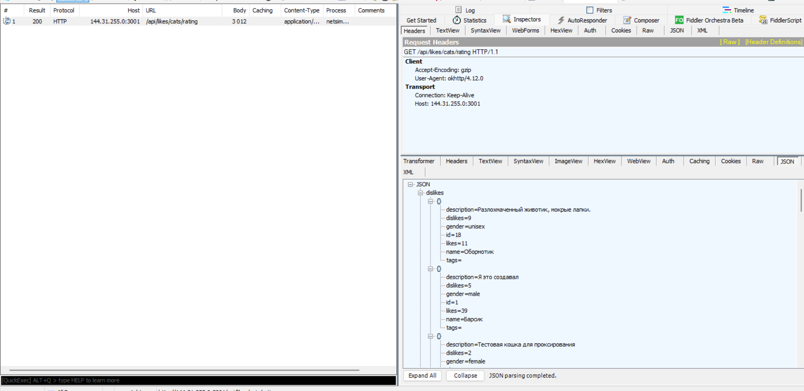

**Лог Fiddler:**

```text
logs/01_rating_request.saz
```

---

### 7.2. Поиск котика

В приложении был выполнен поиск котика по имени `Барсик`.

| Поле          | Значение                                           |
| ------------- | -------------------------------------------------- |
| Действие      | Поиск котика по имени                              |
| HTTP method   | POST                                               |
| URL           | `http://144.31.255.0:3001/api/core/cats/search`    |
| Request body  | `{"gender":null,"name":"Барсик","order":"asc"}`    |
| Response code | 200                                                |
| Response body | JSON со списком найденных котиков                  |
| Комментарий   | Приложение отправляет параметры поиска в JSON body |

Request body:

```json
{
  "gender": null,
  "name": "Барсик",
  "order": "asc"
}
```

Фрагмент ответа:

```json
{
  "groups": [
    {
      "cats": [
        {
          "description": "Я это создавал",
          "dislikes": 5,
          "gender": "male",
          "id": 1,
          "likes": 39,
          "name": "Барсик",
          "tags": ""
        }
      ],
      "count": 1,
      "title": "Б"
    }
  ]
}
```

**Доказательство:**

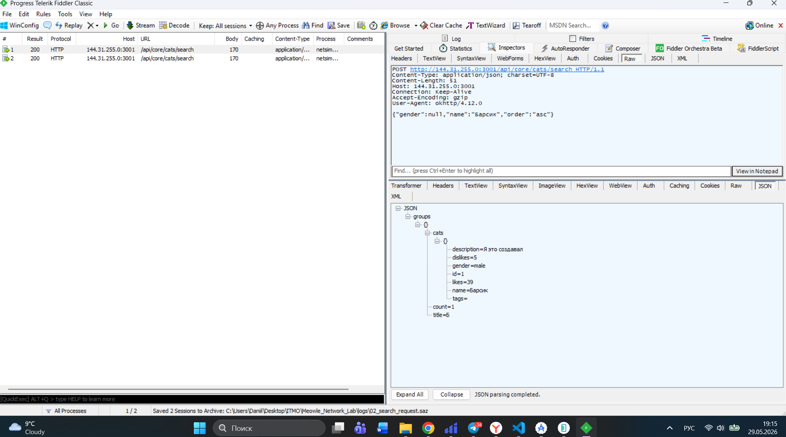

**Лог Fiddler:**

```text
logs/02_search_request.saz
```

---

### 7.3. Открытие карточки котика

После выбора котика `Барсик` приложение запросило данные карточки по `id`.

| Поле          | Значение                                                |
| ------------- | ------------------------------------------------------- |
| Действие      | Открытие карточки котика                                |
| HTTP method   | GET                                                     |
| URL           | `http://144.31.255.0:3001/api/core/cats/get-by-id?id=1` |
| Request body  | Отсутствует                                             |
| Response code | 200                                                     |
| Response body | JSON с объектом `cat`                                   |
| Комментарий   | Приложение получает карточку котика по ID               |

Response body:

```json
{
  "cat": {
    "description": "Я это создавал",
    "dislikes": 5,
    "gender": "male",
    "id": 1,
    "likes": 39,
    "name": "Барсик",
    "tags": ""
  }
}
```

**Доказательство:**


**Лог Fiddler:**

```text
logs/03_cat_card_requests.saz
```

---

### 7.4. Получение списка фото карточки

При открытии карточки приложение дополнительно запросило список изображений котика.

| Поле          | Значение                                            |
| ------------- | --------------------------------------------------- |
| Действие      | Получение списка фото карточки                      |
| HTTP method   | GET                                                 |
| URL           | `http://144.31.255.0:3001/api/photos/cats/1/photos` |
| Request body  | Отсутствует                                         |
| Response code | 200                                                 |
| Response body | `{"images":["/photos/image-1779995885929.jpg"]}`    |
| Комментарий   | Приложение отдельно получает список фото для котика |

Response body:

```json
{
  "images": [
    "/photos/image-1779995885929.jpg"
  ]
}
```

**Доказательство:**


---

### 7.5. Лайк котика

На карточке котика `Барсик` была нажата кнопка лайка.

| Поле          | Значение                                          |
| ------------- | ------------------------------------------------- |
| Действие      | Лайк котика                                       |
| HTTP method   | POST                                              |
| URL           | `http://144.31.255.0:3001/api/likes/cats/1/likes` |
| Request body  | `{"dislike":false,"like":true}`                   |
| Response code | 200                                               |
| Response body | JSON котика с обновлённым количеством лайков      |
| Комментарий   | Сервер увеличил количество лайков                 |

Request body:

```json
{
  "dislike": false,
  "like": true
}
```

Response body:

```json
{
  "description": "Я это создавал",
  "dislikes": 5,
  "gender": "male",
  "id": 1,
  "likes": 40,
  "name": "Барсик",
  "tags": ""
}
```

**Доказательство:**

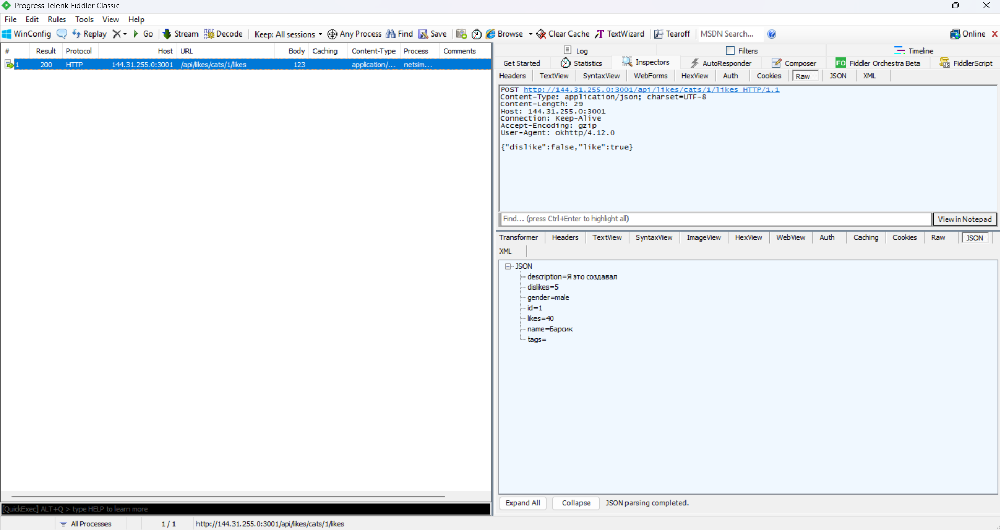

**Лог Fiddler:**

```text
logs/04_like_request.saz
```

---

### 7.6. Дизлайк котика

На карточке котика `Барсик` была нажата кнопка дизлайка.

| Поле          | Значение                                          |
| ------------- | ------------------------------------------------- |
| Действие      | Дизлайк котика                                    |
| HTTP method   | POST                                              |
| URL           | `http://144.31.255.0:3001/api/likes/cats/1/likes` |
| Request body  | `{"dislike":true,"like":false}`                   |
| Response code | 200                                               |
| Response body | JSON котика с обновлённым количеством дизлайков   |
| Комментарий   | Сервер увеличил количество дизлайков              |

Request body:

```json
{
  "dislike": true,
  "like": false
}
```

Response body:

```json
{
  "description": "Я это создавал",
  "dislikes": 6,
  "gender": "male",
  "id": 1,
  "likes": 40,
  "name": "Барсик",
  "tags": ""
}
```

**Доказательство:**

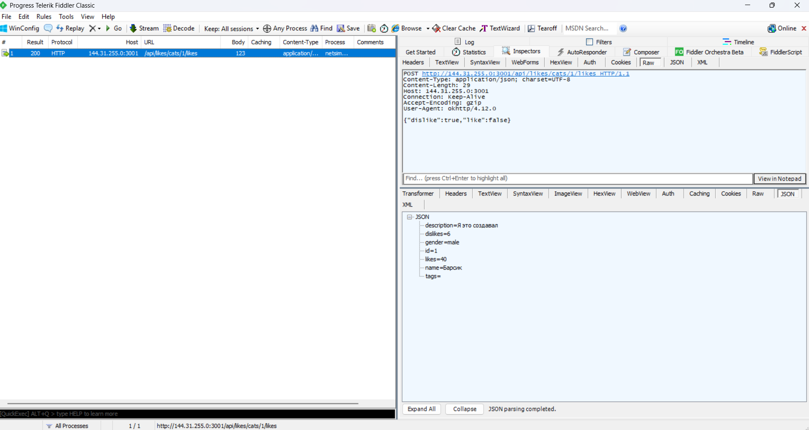

**Лог Fiddler:**

```text
logs/05_dislike_request.saz
```

---

### 7.7. Добавление нового котика

В приложении был создан новый котик:

```text
Имя: Леопольд
Пол: male
Описание: Тестовый кот для лабораторной работы по сетям и протоколам.
```

| Поле          | Значение                                     |
| ------------- | -------------------------------------------- |
| Действие      | Добавление нового котика                     |
| HTTP method   | POST                                         |
| URL           | `http://144.31.255.0:3001/api/core/cats/add` |
| Request body  | JSON с массивом `cats`                       |
| Response code | 200                                          |
| Response body | JSON с созданным котиком                     |
| Комментарий   | Сервер создал новую запись и вернул ID       |

Request body:

```json
{
  "cats": [
    {
      "description": "Тестовый кот для лабораторной работы по сетям и протоколам.",
      "gender": "male",
      "name": "Леопольд"
    }
  ]
}
```

Response body:

```json
{
  "cats": [
    {
      "description": "Тестовый кот для лабораторной работы по сетям и протоколам.",
      "dislikes": 0,
      "gender": "male",
      "id": 27,
      "likes": 0,
      "name": "Леопольд",
      "tags": ""
    }
  ]
}
```

Созданный котик получил ID:

```text
catId = 27
```

**Доказательство:**

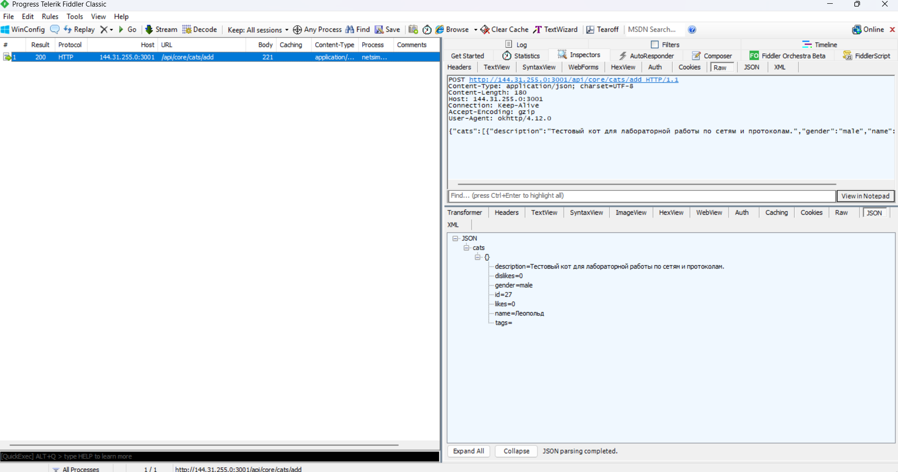

**Лог Fiddler:**

```text
logs/06_add_cat_request.saz
```

---

### 7.8. Изменение описания котика

Для созданного котика `Леопольд` с `id=27` было изменено описание.

| Поле          | Значение                                                  |
| ------------- | --------------------------------------------------------- |
| Действие      | Изменение описания котика                                 |
| HTTP method   | POST                                                      |
| URL           | `http://144.31.255.0:3001/api/core/cats/save-description` |
| Request body  | JSON с `catDescription` и `catId`                         |
| Response code | 200                                                       |
| Response body | JSON котика с обновлённым описанием                       |
| Комментарий   | Сервер изменил описание котика                            |

Request body:

```json
{
  "catDescription": "Описание изменено через мобильное приложение. Тест для лабораторной работы.",
  "catId": 27
}
```

Response body:

```json
{
  "description": "Описание изменено через мобильное приложение. Тест для лабораторной работы.",
  "dislikes": 0,
  "gender": "male",
  "id": 27,
  "likes": 0,
  "name": "Леопольд",
  "tags": ""
}
```

**Доказательство:**

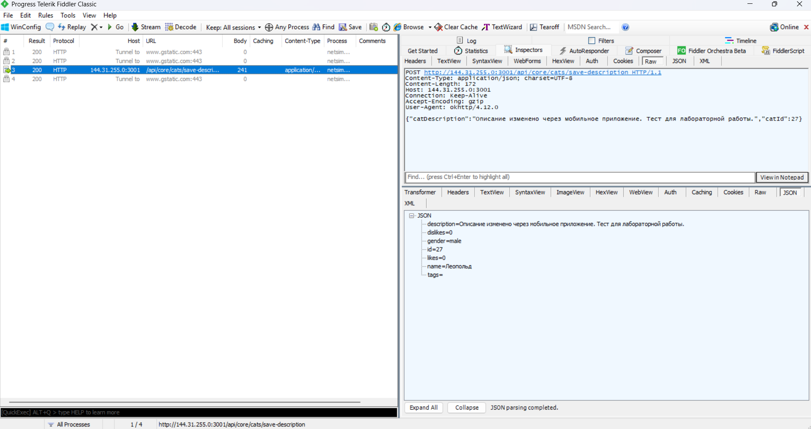

**Лог Fiddler:**

```text
logs/07_update_description_request.saz
```

---

### 7.9. Загрузка изображения

Для котика `Леопольд` с `id=27` было загружено изображение.

| Поле          | Значение                                                                        |
| ------------- | ------------------------------------------------------------------------------- |
| Действие      | Загрузка изображения                                                            |
| HTTP method   | POST                                                                            |
| URL           | `http://144.31.255.0:3001/api/photos/cats/27/upload`                            |
| Request body  | `multipart/form-data`, поле `file`, файл `file.jpg`, `Content-Type: image/jpeg` |
| Response code | 200                                                                             |
| Response body | `{"fileUrl":"/photos/image-1780074640467.jpg"}`                                 |
| Комментарий   | Сервер принял изображение и вернул путь к загруженному файлу                    |

Фрагмент multipart-запроса:

```text
Content-Type: multipart/form-data; boundary=...
Content-Disposition: form-data; name="file"; filename="file.jpg"
Content-Type: image/jpeg
```

Response body:

```json
{
  "fileUrl": "/photos/image-1780074640467.jpg"
}
```

**Доказательство:**


**Лог Fiddler:**

```text
logs/08_upload_photo_request.saz
```

---

## 8. Сводная таблица действий приложения

| №  | Действие в приложении   | HTTP method | URL                               | Request body                                    | Response code | Комментарий                          |
| -- | ----------------------- | ----------- | --------------------------------- | ----------------------------------------------- | ------------- | ------------------------------------ |
| 1  | Открытие рейтинга       | GET         | `/api/likes/cats/rating`          | Отсутствует                                     | 200           | Получение рейтинга котиков           |
| 2  | Поиск котика            | POST        | `/api/core/cats/search`           | `{"gender":null,"name":"Барсик","order":"asc"}` | 200           | Поиск по имени                       |
| 3  | Открытие карточки       | GET         | `/api/core/cats/get-by-id?id=1`   | Отсутствует                                     | 200           | Получение карточки по ID             |
| 4  | Получение фото карточки | GET         | `/api/photos/cats/1/photos`       | Отсутствует                                     | 200           | Получение списка фото                |
| 5  | Лайк                    | POST        | `/api/likes/cats/1/likes`         | `{"dislike":false,"like":true}`                 | 200           | Увеличение likes                     |
| 6  | Дизлайк                 | POST        | `/api/likes/cats/1/likes`         | `{"dislike":true,"like":false}`                 | 200           | Увеличение dislikes                  |
| 7  | Добавление котика       | POST        | `/api/core/cats/add`              | JSON с массивом `cats`                          | 200           | Создание котика `id=27`              |
| 8  | Изменение описания      | POST        | `/api/core/cats/save-description` | `{"catDescription":"...","catId":27}`           | 200           | Изменение описания                   |
| 9  | Загрузка изображения    | POST        | `/api/photos/cats/27/upload`      | `multipart/form-data`                           | 200           | Загрузка JPEG-файла                  |
| 10 | Проверка фото           | GET         | `/api/photos/cats/27/photos`      | Отсутствует                                     | 200           | Получение списка фото после загрузки |

---

## 9. Эксперименты с изменением запросов


### Эксперимент 1. Изменение `catId` в запросе карточки

**Цель:** проверить возможность прямого доступа к объектам по ID.

**Исходный запрос:**

```http
GET /api/core/cats/get-by-id?id=27 HTTP/1.1
Host: 144.31.255.0:3001
```

**Изменённый запрос:**

```http
GET /api/core/cats/get-by-id?id=21 HTTP/1.1
Host: 144.31.255.0:3001
```

**Ответ сервера:**
Сервер вернул `200 OK` и JSON с карточкой котика `id=21`.

**Изменилось ли состояние данных:**
Нет. Запрос только читает данные и не изменяет состояние сервера.

**Security / bug:**
Да, это потенциальная IDOR-проблема. Клиент может вручную изменить `id` в URL и получить данные другого объекта без дополнительной проверки прав доступа.

**Рекомендация:**
Сервер должен проверять авторизацию и права доступа к объектам. Нельзя полагаться на то, что мобильный клиент будет запрашивать только “разрешённые” `id`.

**Доказательство:**

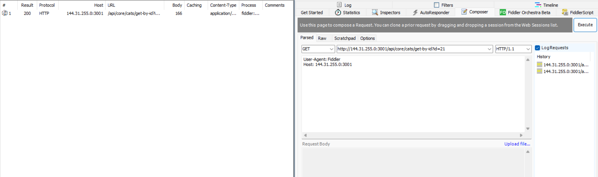

---

### Эксперимент 2. Повтор лайка несколько раз

**Цель:** проверить, можно ли накручивать рейтинг повторной отправкой одного и того же запроса.

**Исходный запрос:**

```http
POST /api/likes/cats/30/likes HTTP/1.1
Host: 144.31.255.0:3001
Content-Type: application/json
```

```json
{
  "dislike": false,
  "like": true
}
```

**Изменённый запрос:**
Тот же запрос был отправлен несколько раз подряд через Fiddler Composer.

**Ответ сервера:**
Все повторные запросы вернули `200 OK`. После нескольких повторов сервер вернул JSON с котиком `id=30`, у которого значение `likes` стало равно `6`.

**Изменилось ли состояние данных:**
Да. Состояние данных изменилось: счётчик `likes` увеличился после повторной отправки одинакового запроса.

**Security / bug:**
Да. Это проблема бизнес-логики: сервер позволяет повторять один и тот же запрос лайка и накручивать рейтинг. Ограничение должно быть реализовано на сервере, а не только в мобильном клиенте.

**Рекомендация:**
Сервер должен хранить состояние голоса пользователя и запрещать повторное увеличение счётчика одним и тем же пользователем. Повторная отправка одинакового запроса должна либо не менять состояние, либо обновлять предыдущий голос.

**Доказательство:**

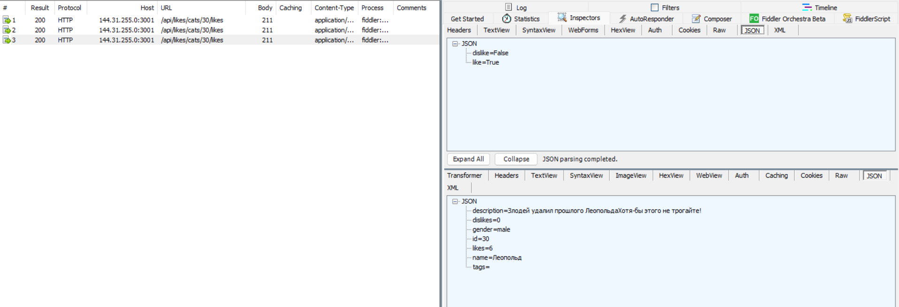

---

### Эксперимент 3. Изменение описания через изменённый request body

**Цель:** проверить, принимает ли сервер изменённое тело запроса.

**Исходный запрос:**

```http
POST /api/core/cats/save-description HTTP/1.1
Host: 144.31.255.0:3001
Content-Type: application/json
```

```json
{
  "catDescription": "Описание изменено через мобильное приложение. Тест для лабораторной работы.",
  "catId": 30
}
```

**Изменённый запрос:**

```json
{
  "catDescription": "Леопольд вернулся. Больше не удаляйте",
  "catId": 30
}
```

**Ответ сервера:**
Сервер вернул `200 OK` и JSON с обновлённым объектом котика `id=30`. В ответе поле `description` изменилось на значение `Леопольд вернулся. Больше не удаляйте`.

**Изменилось ли состояние данных:**
Да. Описание котика `id=30` было изменено на сервере.

**Security / bug:**
Да. Сервер принимает изменение описания напрямую через API-запрос. При отсутствии авторизации и проверки владельца объекта любой клиент, имеющий `catId`, может изменить описание записи.

**Рекомендация:**
Сервер должен проверять авторизацию пользователя и права на изменение конкретного объекта. Также необходимо логировать изменения и валидировать длину/содержимое поля `catDescription`.

**Доказательство:**

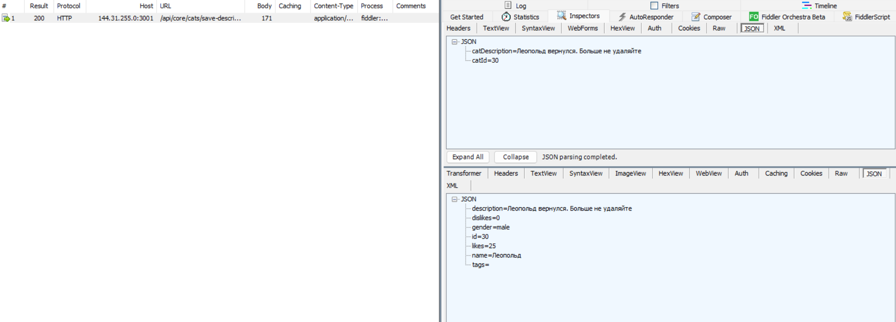

---

### Эксперимент 4. Добавление дубликата имени

**Цель:** проверить наличие проверки уникальности имени.

**Исходный запрос:**

```http
POST /api/core/cats/add HTTP/1.1
Host: 144.31.255.0:3001
Content-Type: application/json
```

```json
{
  "cats": [
    {
      "description": "Тестовый кот для лабораторной работы по сетям и протоколам.",
      "gender": "male",
      "name": "Леопольд"
    }
  ]
}
```


**Изменённый запрос:**
Тот же запрос был отправлен повторно с именем уже существующего котика `Леопольд`.

```json
{
  "cats": [
    {
      "description": "Дубликат имени для проверки серверной валидации.",
      "gender": "male",
      "name": "Леопольд"
    }
  ]
}
```

**Ответ сервера:**
Сервер вернул `200 OK`, но в теле ответа содержалась ошибка:

```json
{
  "cats": {
    "errorDescription": "Такое значение уже существует"
  }
}
```

**Изменилось ли состояние данных:**
Нет. Новый котик с дублирующимся именем создан не был.

**Security / bug:**
Частично корректное поведение: сервер проверяет уникальность имени и не создаёт дубликат. Однако HTTP-статус `200 OK` для ошибки валидации неудачен. Более корректно вернуть `400 Bad Request` или `409 Conflict`.

**Рекомендация:**
Оставить проверку уникальности на backend-уровне, но изменить HTTP-статус ответа на `409 Conflict` для дубликата или `400 Bad Request` для ошибки валидации. Клиенту будет проще корректно обрабатывать ошибку.

**Доказательство:**

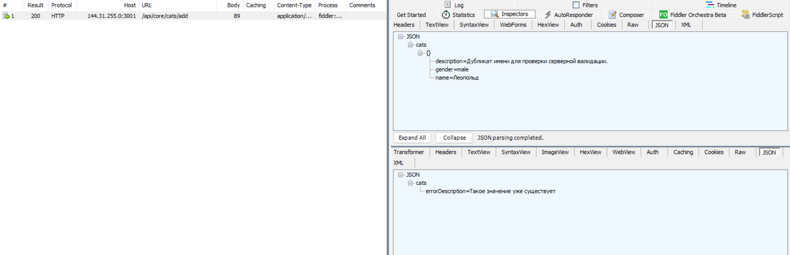

---

### Эксперимент 5. Невалидные значения `gender` и `name`

**Цель:** проверить серверную валидацию полей `gender` и `name`.

**Изменённый запрос:**

```http
POST /api/core/cats/add HTTP/1.1
Host: 144.31.255.0:3001
Content-Type: application/json
```

```json
{
  "cats": [
    {
      "description": "Проверка невалидного gender",
      "gender": "dragon",
      "name": "InvalidGenderCat"
    }
  ]
}
```

**Ответ сервера:**
Сервер вернул `200 OK`, но в теле ответа содержалась ошибка:

```json
{
  "cats": {
    "errorDescription": "Только имена на русском!"
  }
}
```

**Изменилось ли состояние данных:**
Нет. Новая запись создана не была.

**Security / bug:**
Сервер выполняет валидацию имени и не принимает латинские символы, что является корректной серверной проверкой. Однако HTTP-статус `200 OK` для ошибки валидации неудачен. Более корректно возвращать `400 Bad Request`.

Также в этом запросе было передано невалидное значение `gender = dragon`, но сервер вернул ошибку по имени раньше, чем была проверена валидация пола.

**Рекомендация:**
Сохранять серверную валидацию имени, дополнительно явно валидировать поле `gender` по списку допустимых значений (`male`, `female`, `unisex`) и возвращать корректный HTTP-статус `400 Bad Request` для ошибок валидации.

**Доказательство:**

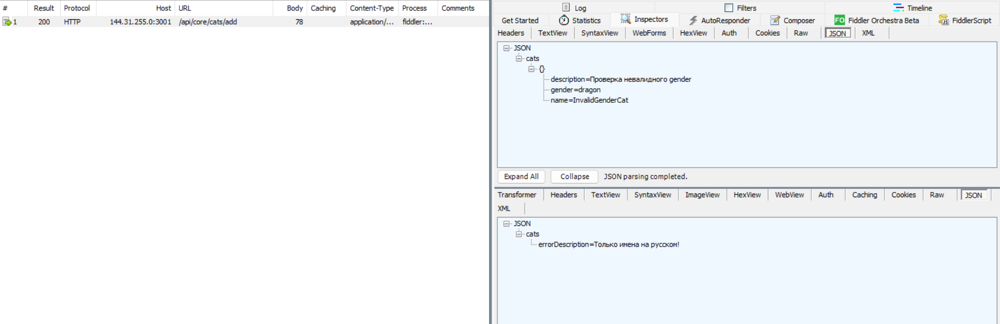

---

### Эксперимент 6. Несуществующий `catId`

**Цель:** проверить обработку несуществующего объекта.

**Изменённый запрос:**

```http
GET /api/core/cats/get-by-id?id=999999 HTTP/1.1
Host: 144.31.255.0:3001
```

**Ответ сервера:**
Сервер вернул `404 Not Found`. В заголовках ответа указан `Content-Type: application/json; charset=utf-8`.

**Изменилось ли состояние данных:**
Нет. Запрос только читает данные и не изменяет состояние сервера.

**Security / bug:**
Критичной security-проблемы не выявлено. Сервер корректно не возвращает данные для несуществующего `catId`. Поведение можно считать корректным, так как используется подходящий HTTP-статус `404 Not Found`.

**Рекомендация:**
Оставить обработку несуществующих объектов через `404 Not Found`. Дополнительно можно возвращать унифицированное JSON-сообщение об ошибке, например `{"error":"Cat not found"}`, чтобы клиенту было проще обрабатывать ошибку.

**Доказательство:**

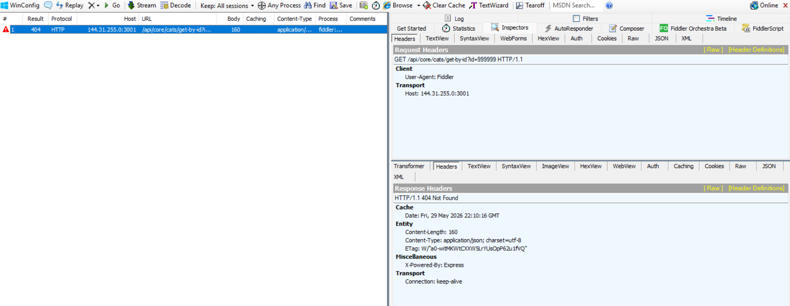

---

## 10. Эксперименты с изменением ответов

### Эксперимент 1. Подмена имени и описания котика в ответе поиска

**Цель:** проверить, как клиент отображает изменённый ответ сервера.

**Исходный ответ:**  
При поиске `Леопольд` сервер возвращал объект котика с именем `Леопольд` и описанием `Леопольд вернулся. Больше не удаляйте`.

**Изменённый ответ:**  
Через Fiddler AutoResponder был подставлен локальный JSON-файл. В нём имя котика было изменено на `Леопольдик`, а описание — на `Описание подменено через Fiddler AutoResponder. На сервере это значение не сохранялось.`

**Результат:**  
Мобильное приложение отобразило изменённые данные из подменённого ответа. Изменение осталось только на клиенте и не сохранилось на сервере.

**Вывод:**  
Клиент полностью доверяет данным, пришедшим в HTTP-ответе. Подмена ответа влияет на отображение в приложении, но не изменяет состояние backend API.

**Доказательства:**

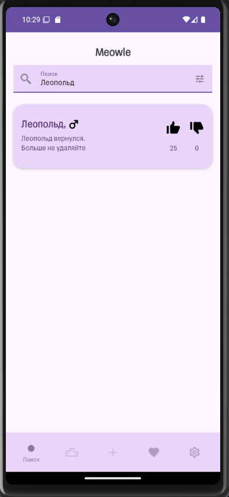

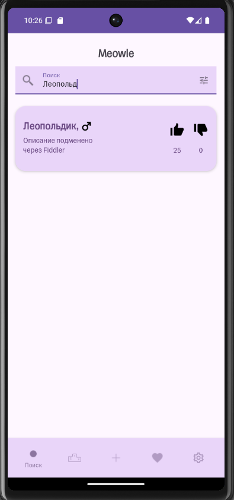
---

### Эксперимент 2. Подмена количества лайков/дизлайков

**Цель:** проверить, доверяет ли клиент значениям `likes` и `dislikes`, полученным в HTTP-ответе.

**Исходный ответ:**  
При открытии карточки котика `Леопольд` сервер возвращал реальные значения `likes` и `dislikes`.

**Изменённый ответ:**  
Через Fiddler AutoResponder был подставлен локальный JSON-файл для запроса:

```http
GET /api/core/cats/get-by-id?id=30 HTTP/1.1
Host: 144.31.255.0:3001
```

В подменённом ответе значения были изменены:

```json
{
  "cat": {
    "description": "Леопольд вернулся. Больше не удаляйте",
    "dislikes": 5,
    "gender": "male",
    "id": 30,
    "likes": 75,
    "name": "Леопольд",
    "tags": ""
  }
}
```

**Результат:**
Мобильное приложение отобразило подменённые значения лайков и дизлайков. Изменение осталось только на клиенте и не сохранилось на сервере.

**Вывод:**
Клиент доверяет числовым значениям, пришедшим в HTTP-ответе. Подмена ответа влияет только на отображение в приложении, но не изменяет реальные данные на backend.

**Доказательства:**


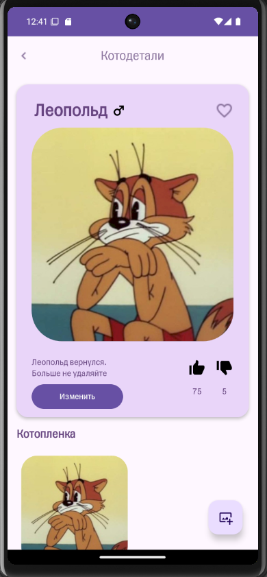

---

### Эксперимент 3. Подмена списка результатов поиска

**Цель:** проверить, как приложение отображает изменённый список результатов поиска.

**Исходный ответ:**  
При поиске `Леопольд` сервер возвращал реальный список найденных котиков.

**Изменённый ответ:**  
Через Fiddler AutoResponder был подставлен локальный JSON-файл для запроса:

```http
POST /api/core/cats/search HTTP/1.1
Host: 144.31.255.0:3001
```

В подменённом ответе список результатов был изменён: вместо обычного результата клиент получил два объекта — `Леопольдик` и `ФейковыйКотик`.

```json
{
  "groups": [
    {
      "cats": [
        {
          "description": "Первый кот из подменённого списка. Этот объект пришёл из локального JSON-файла Fiddler.",
          "dislikes": 0,
          "gender": "male",
          "id": 30,
          "likes": 9999,
          "name": "Леопольдик",
          "tags": ""
        },
        {
          "description": "Второй кот добавлен только в подменённый ответ. На сервере такая запись не создавалась.",
          "dislikes": 123,
          "gender": "unisex",
          "id": 9999,
          "likes": 777,
          "name": "ФейковыйКотик",
          "tags": "fake"
        }
      ],
      "count": 2,
      "title": "Л"
    }
  ]
}
```

**Результат:**
Мобильное приложение отобразило список из подменённого HTTP-ответа. Добавленный объект `ФейковыйКотик` существовал только в ответе, подставленном Fiddler, и не был создан на сервере.

**Вывод:**
Изменение HTTP-ответа влияет только на отображение данных в приложении. Серверное состояние при этом не изменяется.

**Доказательства:**

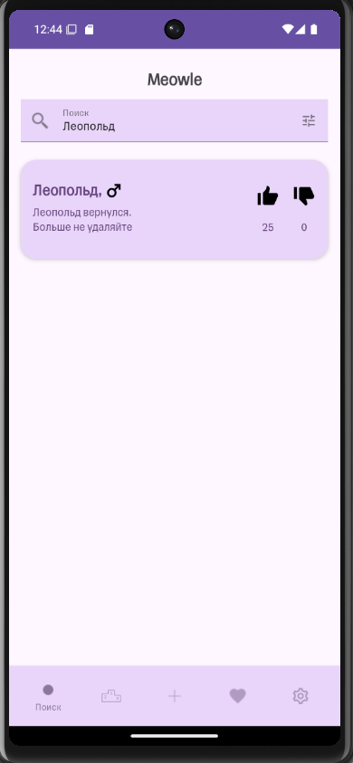

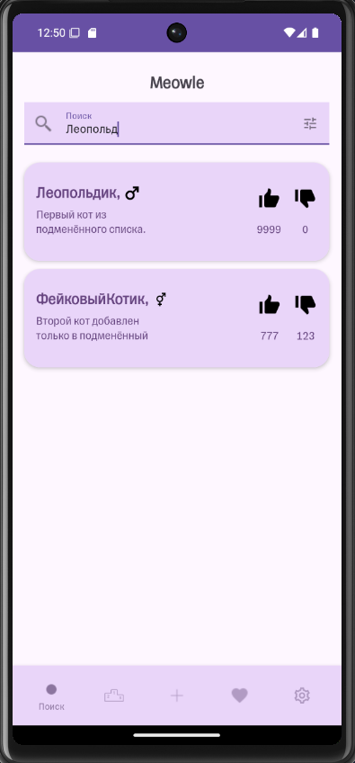

---

### Эксперимент 4. Подмена списка фото или URL изображения

**Цель:** проверить, можно ли изменить отображаемое изображение на клиенте через подмену HTTP-ответа.

**Исходный ответ:**  
При открытии карточки котика `Леопольд` приложение запрашивало список изображений:

```http
GET /api/photos/cats/30/photos HTTP/1.1
Host: 144.31.255.0:3001
```

Сервер возвращал список реальных изображений котика.

**Изменённый ответ:**
Через Fiddler AutoResponder был подставлен локальный JSON-файл:

```json
{
  "images": [
    "/photos/image-1780074640467.jpg"
  ]
}
```

**Результат:**
Мобильное приложение приняло подменённый список фото и попыталось загрузить изображение по URL из изменённого ответа. Изменение затронуло только клиентское отображение и не изменило данные на сервере.

**Вывод:**
Клиент доверяет списку изображений, который приходит от backend API. Подмена ответа позволяет изменить отображаемое фото на стороне клиента, но не меняет фактическое состояние backend API.

**Доказательства:**

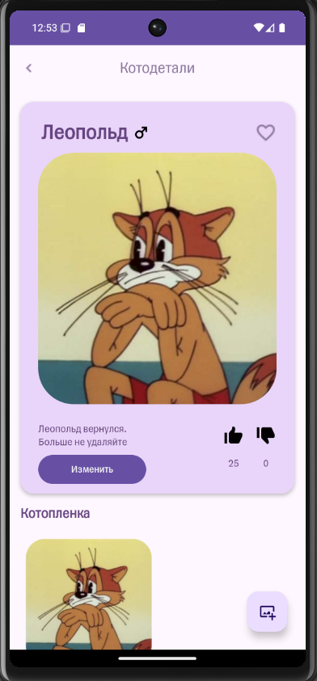

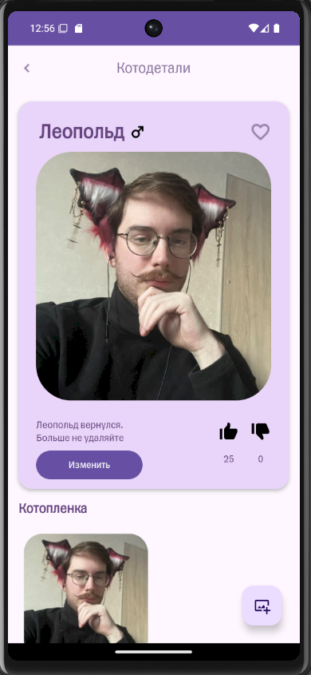

---

## 11. Security findings

### Finding 1. Отсутствие видимой авторизации в API-запросах

**Title:** API-запросы выполняются без видимого токена авторизации
**Severity:** High

**Preconditions:**
Есть доступ к мобильному приложению или возможность отправлять HTTP-запросы к backend API.

**Steps to reproduce:**

1. Запустить приложение Meowle через Android Emulator.
2. Настроить Fiddler Classic как HTTP proxy.
3. Выполнить действия в приложении: поиск, открытие карточки, лайк, изменение описания.
4. Посмотреть перехваченные запросы в Fiddler.
5. Проверить HTTP-заголовки запросов.

**Actual result:**
В перехваченных запросах не использовались видимые заголовки авторизации, например `Authorization: Bearer ...`. Запросы к API выполнялись только с базовыми заголовками вроде `Host`, `User-Agent`, `Content-Type`.

**Expected result:**
Критичные действия должны требовать серверной авторизации. Backend должен проверять пользователя по токену или сессии, а не доверять только данным из тела запроса или URL.

**Evidence:**
Скриншоты запросов:

```text
03_app_requests/04_like_request.png
03_app_requests/07_update_description_request.png
04_modified_requests/03_modify_description_body.png
```

**Recommendation:**
Добавить авторизацию на backend-уровне. Для мобильного клиента использовать access token, например JWT или session token. Все действия изменения данных должны проверять пользователя на сервере.

---

### Finding 2. Direct Object Reference через `catId`

**Title:** Прямой доступ к объектам по изменяемому `catId`
**Severity:** Medium

**Preconditions:**
Пользователь знает или может подобрать `catId`.

**Steps to reproduce:**

1. Открыть карточку своего котика.
2. Перехватить запрос:

   ```http
   GET /api/core/cats/get-by-id?id=30
   ```
3. Через Fiddler Composer изменить `id` на другой существующий:

   ```http
   GET /api/core/cats/get-by-id?id=21
   ```
4. Отправить изменённый запрос.

**Actual result:**
Сервер вернул `200 OK` и данные другого котика по изменённому `id`.

**Expected result:**
Сервер должен проверять, имеет ли пользователь право получать конкретный объект. Если данные публичные, это должно быть явно предусмотрено логикой приложения. Если объект принадлежит другому пользователю, сервер должен ограничивать доступ.

**Evidence:**

```text
04_modified_requests/01_change_catid_get_by_id.png
```

**Recommendation:**
Добавить проверку прав доступа к объектам на backend-уровне. Не полагаться на то, что мобильный клиент будет отправлять только разрешённые `id`.

---

### Finding 3. Возможность накрутки рейтинга повторным запросом лайка

**Title:** Повторная отправка запроса лайка увеличивает счётчик
**Severity:** Medium

**Preconditions:**
Есть доступ к endpoint лайка.

**Steps to reproduce:**

1. Создать или открыть котика.
2. Перехватить запрос лайка:

   ```http
   POST /api/likes/cats/30/likes
   ```
3. Повторить этот же запрос несколько раз через Fiddler Composer.
4. Проверить значение `likes` в ответе сервера.

**Actual result:**
Все повторные запросы вернули `200 OK`. После нескольких повторов значение `likes` у котика `id=30` увеличилось до `6`.

**Expected result:**
Один пользователь должен иметь возможность поставить только один лайк или изменить свой предыдущий голос. Повторная отправка одинакового запроса не должна бесконечно увеличивать рейтинг.

**Evidence:**

```text
04_modified_requests/02_replay_like.png
```

**Recommendation:**
Хранить состояние голосования на сервере: `userId`, `catId`, тип голоса. Повторный лайк должен либо игнорироваться, либо обновлять существующий голос, но не увеличивать счётчик повторно.

---

### Finding 4. Изменение описания через прямой API-запрос

**Title:** Описание котика изменяется через прямой запрос к API
**Severity:** High

**Preconditions:**
Известен `catId` котика.

**Steps to reproduce:**

1. Перехватить запрос изменения описания:

   ```http
   POST /api/core/cats/save-description
   ```
2. Через Fiddler Composer изменить `catDescription`.
3. Отправить запрос:

   ```json
   {
     "catDescription": "Леопольд вернулся. Больше не удаляйте",
     "catId": 30
   }
   ```
4. Проверить ответ сервера.

**Actual result:**
Сервер вернул `200 OK` и обновил поле `description` у котика `id=30`.

**Expected result:**
Сервер должен проверять, имеет ли текущий пользователь право изменять описание конкретного котика. Нельзя доверять только значению `catId`, пришедшему от клиента.

**Evidence:**

```text
04_modified_requests/03_modify_description_body.png
```

**Recommendation:**
Добавить проверку владельца или прав доступа на backend-уровне. Также следует логировать изменения и ограничивать возможность массового редактирования объектов.

---

### Finding 5. Ошибки валидации возвращаются с HTTP 200 OK

**Title:** Сервер возвращает `200 OK` при ошибках валидации
**Severity:** Low / Medium

**Preconditions:**
Есть доступ к endpoint создания котика.

**Steps to reproduce:**

1. Отправить запрос создания котика с уже существующим именем:

   ```http
   POST /api/core/cats/add
   ```
2. Проверить HTTP-статус и тело ответа.
3. Отправить запрос с некорректным именем на латинице.
4. Проверить HTTP-статус и тело ответа.

**Actual result:**
При попытке добавить дубликат имени сервер вернул `200 OK`, но в теле ответа была ошибка:

```json
{
  "cats": {
    "errorDescription": "Такое значение уже существует"
  }
}
```

При отправке имени на латинице сервер также вернул `200 OK`, но в теле ответа была ошибка:

```json
{
  "cats": {
    "errorDescription": "Только имена на русском!"
  }
}
```

**Expected result:**
Ошибки валидации должны возвращаться с корректными HTTP-статусами:

* `400 Bad Request` — некорректные входные данные;
* `409 Conflict` — конфликт уникальности, например дубликат имени.

**Evidence:**

```text
04_modified_requests/04_duplicate_name.png
04_modified_requests/05_invalid_gender.png
```

**Recommendation:**
Использовать корректные HTTP-статусы для ошибок. Клиенту будет проще отличать успешное создание объекта от ошибки валидации.

---

### Finding 6. Использование HTTP без шифрования

**Title:** API работает по HTTP без TLS
**Severity:** Medium

**Preconditions:**
Клиент и сервер взаимодействуют через HTTP.

**Steps to reproduce:**

1. Настроить Fiddler Classic как HTTP proxy.
2. Запустить приложение в Android Emulator.
3. Выполнить действия в приложении.
4. Проверить, что запросы к backend API идут по адресу:

   ```text
   http://144.31.255.0:3001
   ```
5. Просмотреть request body и response body в Fiddler.

**Actual result:**
Трафик приложения передаётся по HTTP. Fiddler без установки TLS-сертификата видит URL, заголовки, request body и response body. Также через AutoResponder удалось подменять ответы сервера.

**Expected result:**
В реальном приложении API должен использовать HTTPS. Передаваемые данные должны быть защищены от просмотра и изменения посредником в сети.

**Evidence:**

```text
01_setup/01_fiddler_version_check.png
03_app_requests/02_search_request.png
05_modified_responses/01_after_name_rewrite.png
05_modified_responses/02_after_likes_rewrite.png
```

**Recommendation:**
Использовать HTTPS/TLS для всех API-запросов. Для мобильного приложения дополнительно можно применять certificate pinning, если это соответствует требованиям безопасности.

---

### Finding 7. Клиент доверяет подменённым ответам сервера

**Title:** Мобильное приложение отображает данные из подменённых HTTP-ответов
**Severity:** Low / Medium

**Preconditions:**
Есть возможность перехватить и изменить HTTP-ответ, например через Fiddler AutoResponder.

**Steps to reproduce:**

1. Настроить AutoResponder в Fiddler.
2. Подменить ответ поиска `/api/core/cats/search`.
3. Подменить имя `Леопольд` на `Леопольдик`.
4. Подменить список результатов поиска, добавив несуществующего котика.
5. Подменить значения `likes` и `dislikes`.
6. Проверить отображение в приложении.

**Actual result:**
Мобильное приложение отобразило изменённые данные из локального JSON-файла Fiddler. Подменённые имя, описание, лайки и список результатов отображались на клиенте, хотя на сервере эти данные не сохранялись.

**Expected result:**
Клиент обычно отображает данные, пришедшие от сервера, поэтому сам факт отображения подменённых данных ожидаем. Однако в сочетании с HTTP без TLS это показывает риск атак типа Man-in-the-Middle.

**Evidence:**

```text
05_modified_responses/01_after_name_rewrite.png
05_modified_responses/02_after_likes_rewrite.png
05_modified_responses/03_after_search_rewrite.png
05_modified_responses/04_after_photo_rewrite.png
```

**Recommendation:**
Использовать HTTPS/TLS, не передавать чувствительные данные по открытому каналу, а для критичных данных выполнять дополнительные проверки на сервере. Клиент не должен использовать подменяемые данные для принятия security-решений.

---
## 12. Вывод

В ходе лабораторной работы было исследовано сетевое взаимодействие мобильного приложения Meowle с backend API. Для выполнения работы использовались Android Emulator и Fiddler Classic. Такой стенд позволил работать без физического телефона: приложение запускалось в эмуляторе, а весь HTTP-трафик проходил через локальный прокси.

В первой части работы была проверена доступность backend API и Swagger UI, а также составлена карта основных действий приложения. Через Fiddler были перехвачены запросы поиска котиков, открытия карточки, лайка, дизлайка, добавления нового котика, изменения описания, загрузки изображения и открытия рейтинга. Для каждого действия были зафиксированы HTTP method, URL, request body, response code и response body.

Во второй практической части были выполнены эксперименты с изменением запросов. Было показано, что клиентские запросы можно вручную повторять и изменять через Fiddler Composer. Например, изменение `catId` позволяло обращаться к другим объектам, повторная отправка запроса лайка увеличивала счётчик `likes`, а изменение тела запроса `/api/core/cats/save-description` приводило к изменению описания котика на сервере. Также была проверена серверная валидация: сервер не позволил создать дубликат имени и отклонил имя на латинице, однако в обоих случаях вернул `200 OK` с описанием ошибки в JSON, что не является корректным использованием HTTP-статусов.

В третьей практической части были выполнены эксперименты с изменением ответов. Через Fiddler AutoResponder были подменены ответы API: имя и описание котика, количество лайков/дизлайков, список результатов поиска и список изображений. Приложение отображало данные из подменённых JSON-ответов, хотя на сервере эти изменения не сохранялись. Это показало разницу между изменением клиентского отображения и реальным изменением состояния backend API.

Главный вывод лабораторной работы: мобильному клиенту нельзя доверять как источнику корректных данных. Пользователь может перехватить запросы приложения, изменить URL, `catId`, request body, повторить запрос или подменить ответ сервера. Поэтому все важные проверки должны выполняться на стороне сервера, а не только в интерфейсе мобильного приложения.

На сервере должны быть реализованы:

- авторизация пользователя;
- проверка прав доступа к объектам;
- защита от прямого обращения к объектам по ID без проверки прав;
- защита от повторного голосования и накрутки рейтинга;
- строгая валидация входных параметров;
- корректные HTTP-статусы для ошибок валидации;
- проверка загружаемых файлов;
- использование HTTPS для защиты трафика от перехвата и подмены.

Эксперименты показали, что ограничения в мобильном интерфейсе не являются достаточной защитой. Даже если пользователь не может выполнить действие через UI, он может повторить или изменить HTTP-запрос напрямую. Поэтому безопасность приложения должна строиться на backend-проверках, корректной модели прав доступа и защищённом сетевом соединении.
